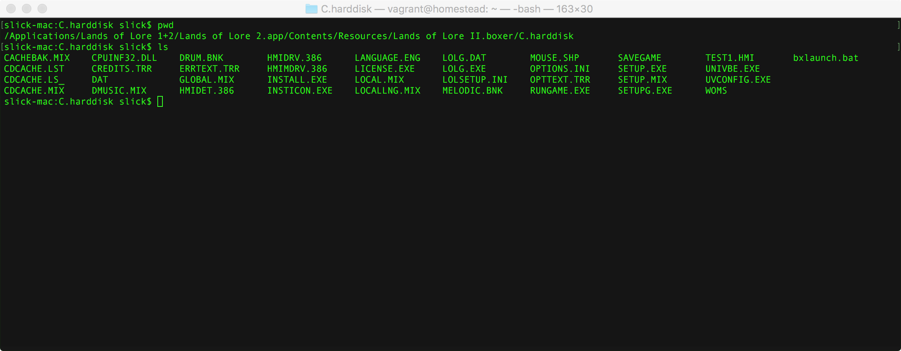
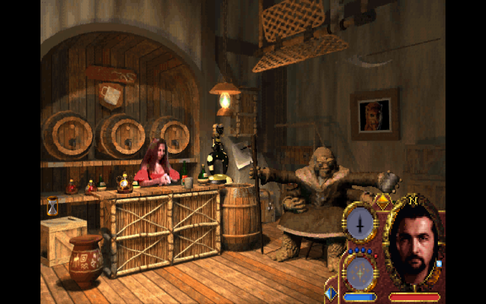
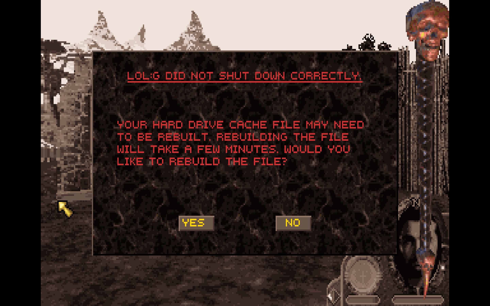
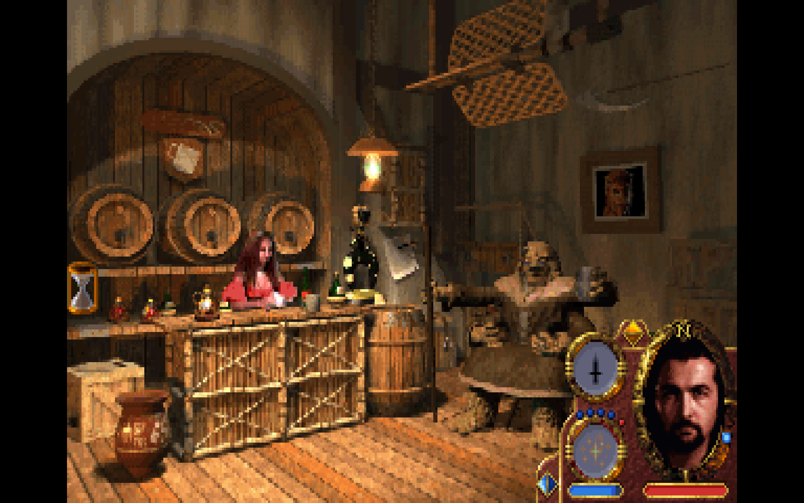
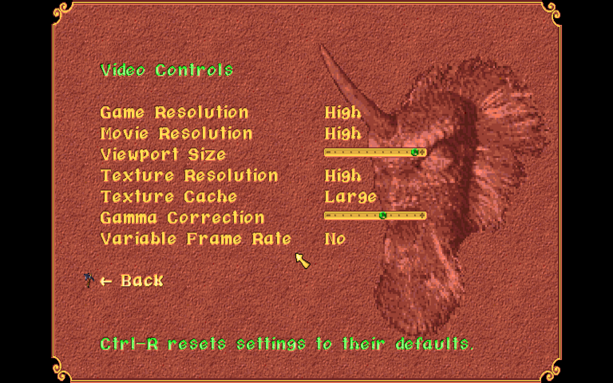

# Lands of Lore: Guardians of Destiny The Cantina Fix for Mac OSX (GOG.com version)

The purpose of this repository is to fix the game error that occurs once you will try to enter the Cantina inside
Huline Village. If you do, the game will crash and quit. **This error appears with the game version from GOG.com**.

## The Error
`Memory allocation of 1309694 bytes failed!! MemAvail: 1319788 Largest: 1244084`

## Installation

The fix is extremely easy to apply (you do it only once). The solution is to run the game with `-LOWMEM` parameter.

Go to:

`cd /Applications/Lands of Lore 1+2/Lands of Lore 2.app/Contents/Resources/Lands of Lore II.boxer/C.harddisk`

and edit:

`bxlaunch.bat`

or checkout the repository inside `C.harddisk`. It will replace existing file. Now before entering the Cantina,
comment line 2 and uncomment line 3. That's all.

## The Cantina

## Final steps

Once you run the game with mentioned parameter, you will be asked to rebuild the cache. Hit **Yes**.

The game will run with the lowest possible resolution.

Talk to Baccata and exit Cantina. Save the game and quit. Restore `bxlaunch.bat` to the original state and simply
run the game again. Finally go to Video Controlls and the the resolution back to `High`.

Enjoy the rest of this awesome game!
